## SEEDlabs: Environment Variable and Set-UID Lab By Dito Prabowo

### 0x00 Intro

Tujuan dari pembelajaran lab ini adalah agar kita bisa mengerti bagaimana Environment variable bisa mempengaruhi program dan system. Environment variable adalah set dari nilai dinamic yang bisa mempengaruhi sebuah proses yang berjalan di computer. Pada lab ini kita akan mengetahui bagaimana Environment variable berjalan, bagaimana bisa diperbanyak atau diadaptasi dari parent proses (program utama/inti) ke child proses (proses turunan dari inti) dan bagaimana pengaruhnya dalam system / program.

### 0x01 Lab Tasks

#### Task 1 : Manipulating Environment variable
Dalam Task ini, kita belajar untuk menampilkan Environment, perintah export dan unset.

Menampilkan Environment : gunakan perintah    

    printenv

atau

    env

Hasil :
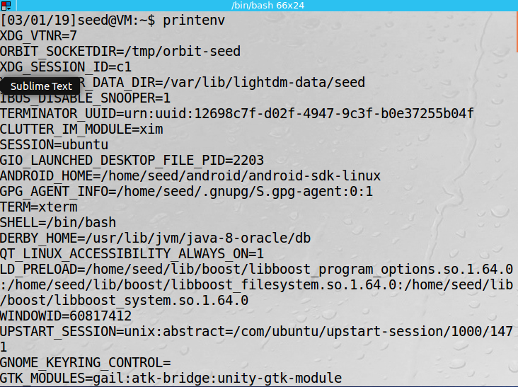

untuk Menampilkan env tertentu misalnya SESSION kita bisa gunakan perintah

    printenv SESSION

atau

    env | grep SESSION

Hasil : 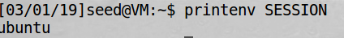

Untuk menambahkan kita bisa menggunakan perintah :

    export

dan untuk menghilangkan :

    unset

Hasil :

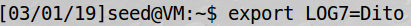

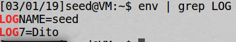

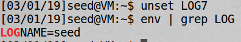

***

### TASK 2 : Inheriting environment variables from parents

Dalam Task ini, kita belajar bagaimana environment variable diturunkan di child proses dari parent proses.
Dalam Unix, fork() membuat proses baru dengan menduplikat proses utama. Proses baru( child proses ) sepenuhnya persis dengan proses utama, tapi ada beberapa yang tidak diturunkan ke child ( untuk mengetahuinya kita bisa lihat manual page fork di _man fork_ ), dalam task ini kita ingin mengetahui apakah parent environment dapat diturunkan di child atau tidak.

#### Step 1

Karena output mengandung banyak strings, kita simpan saja output ke dalam file dengan tanda ">" yang artinya menyimpan hasil ke dalam file tertentu sesuai nama yang kita berikan.

```objective-c
#include<unistd.h>
#include<stdio.h>
#include<stdlib.h>

extern char **environ;

void printenv()
{
    int i = 0;
    while(environ[i] != NULL) {
        printf("%s\n", environ[i]);
        i++;
    }
}

void main()
{
    pid_t childPid;

    switch(childPid = fork()) {
        case 0:    // child process
            printenv();
            exit(0);
        default:   // parent process
            // printenv();
            exit(0);
    }
}
```

Hasil :


#### Step 2
Sekarang comment printenv() pada bagian child, dan uncomment printenv pada bagian parent, compile dan jalankan. simpan hasil kedalam file yang berbeda.


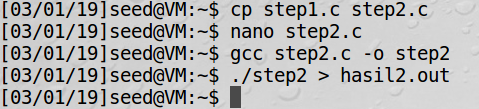
note : pada step2.c sudah dilakukan perintah step2

My observation : pada step 1 kita menampilkan environtment pada proses child dan pada step 2 kita menampilkan environment pada parent proses
#### Step 3

pada step ini, kita menampilkan perbedaan kedua hasil dengan command diff.

Hasil :
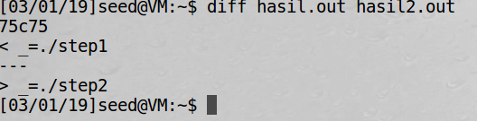

Penjelasan : pada diff ada spesial simbol diantaranya

    a : add
    c : change
    d : delete
    * Lines preceded by a < are lines from the first file.
    * Lines preceded by > are lines from the second file.
    * The three dashes (“—“) merely separate the lines of file 1 and file 2.

Pada hasil diatas berarti kita mendapatkan hasil yang sama kecuali pada line 75 ada perbedaan yaitu pada file pertama "_=./step1" dan pada file kedua "_=./step2", yaitu argumen untuk menjalankan program
***

### Task 3 :  Environment Variables and execve()

Dalam task ini, kita belajar  bagaimana environment variabel mempengaruhi ketika program baru di eksekusi dengan execve(). fungsi execve() memanggil system call untuk memanggil command baru dan mengeksekusinya. fungsi ini tidak pernah kembali. Tidak ada proses baru yang dibuat. dan the calling process's text, data, bss, and stack di overwrite oleh program yang dipanggil. Intinya, execve() menjalankan program baru dalam pemanggilan proses. dalam environment variabel apakah otomatis diturunkan oleh program baru?

#### Step 1

Compile dan jalankan program dibawah ini. program ini mengeksekusi program yang memanggil /usr/bin/env, yang menampilkan environment variabel dari proses yang dijalankan.

```objective-c
#include<stdio.h>
#include<stdlib.h>

extern char **environ;

int main()
{
    char *argv[2];

    argv[0] = "/usr/bin/env";
    argv[1] = NULL;

    execve("/usr/bin/env", argv, NULL);

    return 0;
}
```
Hasil :
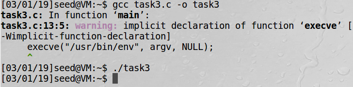

** Hasil : Tidak ada output

### Step 2
Ganti code execve diatas dengan code seperti dibawah

    execve("/usr/bin/env", argv, environ);

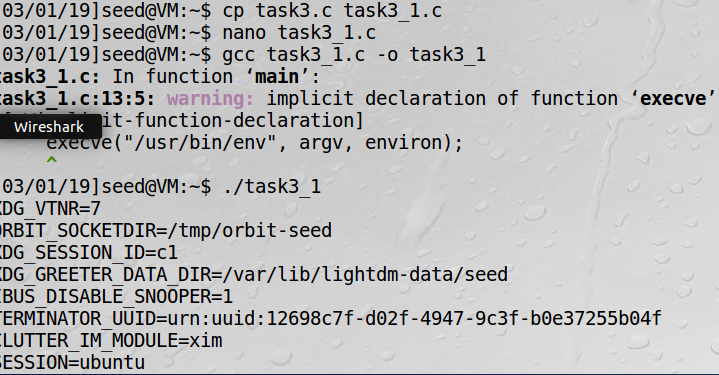

hasilnya keluar environment variabel

Penjelasan :
setelah membaca man execve, ada 3 parameter pada execve yaitu :

    int execve(const char *filename, char *const argv[],
    char *const envp[]);

** pada saat envp[] null,tidak ada yang ditampilkan.
tapi  pada saat envp[] diisi environ, memunculkan semua envriontment.

    extern char **environ;

berarti code diatas meload environtment variabel dan mengeksekusinya dengan execve , dan env tidak bisa langsung dipanggil tanpa meload environment variabel.

-**
***

### Task 4: Environment Variables and system()

Dalam Task ini, kita mengeksekusi environment variabel dengan system(),dengan func system() environtment variabel bisa terload  karena system() menggunakan execl() untuk mengeksekusi /bin/sh; kemudian execl() memanggil execve() yang telah melewatkan envriontment variabel array.
jadi tidak perlu me load environment variabel secara manual

```objective-c
#include<stdio.h>
#include<stdlib.h>

int main()
{
    system("/usr/bin/env");

    return 0;
}
```

hasil :
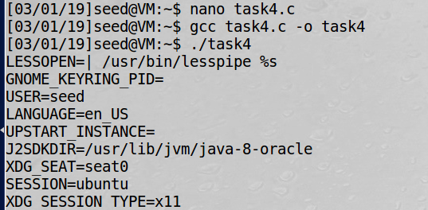

***
### Task 5: Environment variable and Set-UID Programs

Set-UID sangat penting dalam mekanisame keamanan di unix.
ketika set-UID program berjalan, program itu akan menjalankan program sebagai pemilik aslinya.
Contohnya, ada program yang privilage nya root, maka siapapun yang menjalankan program set-UID akan mendapat akses root(dalam program ini) dalam mengeksekusinya.
dalam lab ini kita akan mencoba memahami pengaruhnya set-UID dalam environment variabel.

#### Step 1

 kita buat program untuk menampilkan environment variabel

 ```objective-c
 #include<stdio.h>
 #include<stdlib.h>

 extern char **environ;

 void main()
 {
     int i = 0;
     while(environ[i] != NULL) {
         printf("%s\n", environ[i]);
         i++;
     }
 }
 ```

#### Step2
kita compile program diatas dan mengganti ownership ke root, dan membuat set-UID program.

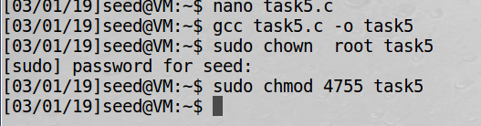

#### Step3
Dalam Bash shell (normal account), gunakan export untuk mengeset beberapa environment variabel

* PATH
* LD_LIBRARY_PATH
* ANY_NAME

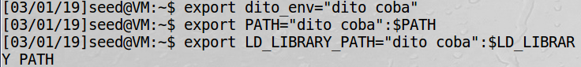

Dalam PATH dan LD..
ditambahkan :$[name] karena agar value sebelumnya tidak hilang, jika hilang bisa menyebabkan bbrapa command tidak bisa dieksekusi langsung, harus memanggil sampek direktori asalnya, misalnya date harus memanggil dengan /bin/date

Lalu eksekusi :

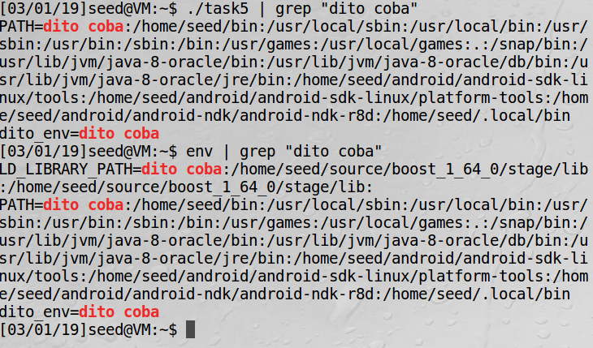


"Please check whether all the environment variables you set in the shell process (parent) get into the Set-UID child process."

Ya,env yang kita set di parent proses berhasil masuk dalam set-UID child proses.

***

### Task 6: The PATH Environment Variable and Set-UID Programs

Karena program shell dijalankan, memanggil system() dengan set-uid program cukup berbahaya.
Karena perilaku aktual dari program shell dapat mempengaruhi environment variabel, misalnya PATH.
salah satu environment variabel ini disediakan oleh user, yang bisa saja user jahat.
Dengan mengganti variabel ini, user jahat dapat mengontrol perilaku dari set-UID program.
Dalam Bash, kamu dapat mengganti env PATH dengan cara ini :

    $ export PATH=/home/seed:$PATH


Set-UID program dibawah ini untuk mengeksekusi perintah /bin/ls; programmer hanya menggunakan relative path untuk perintah ls, tidak menggunakan absolute path.

```objective-c
int main()
{
system("ls");
return 0;
}
```
sekarang kita compile dan mengganti pemilik nya ke root, dan membuat set-UID program.
dapatkah set-uid program ini berjalan dalam /bin/ls? jika dapat,apakah code berjalan dengan root privilage?

Hasil :
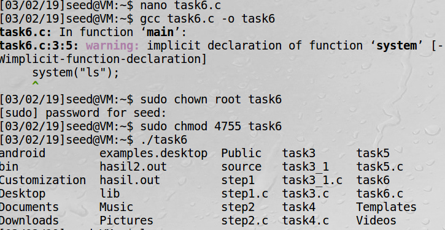

Ya dapat, set-uid bisa menjalankan program /bin/ls dengan relatif path,untuk root privilage nya tidak, dalam task 6 sudah di jelaskan di note for ubuntu 16.04 ,
bahwa

    "The dash shell in Ubuntu 16.04 has a countermeasure that prevents itself from being executed in a Set-UID process. Basically, if dash detects that it is executed in a Set-UID process, it immediately changes the effective user ID to the process’s real user ID, essentially dropping the privilege"

yang berarti ketika kita menjalankan set-uid program akan di countermeasure kita tidak bisa menjalankan nya yg secara teori bisa mendapat root privilage, untuk dapat menjalankan set-uid dengan root privilage, SEEDlabs telah menyediakan program shell yg bernama zsh untuk menggantikan /bin/sh.

untuk bisa menjalankan set-UID program :

(1) kita link /bin/sh ke /bin/zsh

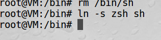

(2) kita coba jalankan program ls diatas dengan zsh

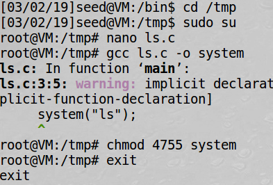

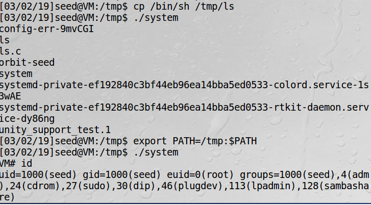

dengan shell zsh kita bisa mendapatkan root shel, tapi dengan shell asli dari ubuntu 16.04 kita tidak bisa mendapatkan shell root.

***

### TASK7 : The LD_PRELOAD environment variable and Set-UID Programs

Dalam task ini, kita belajar bagaimana set-UID program berurusan dengan beberapa env, beberapa env termasuk LD_PRELOAD, LD_LIBRARY_PATH, dan LD_ lainya, mempengaruhi dinamic linker, dinamic linker adalah salah satu part dari OS yang me load dan melink kan berbagai shared library yang dibutuhkan program linux saat di dijalankan.

#### step1

(1) Petama kita siapkan dynamic link library, dan namai dengan mylib untuk mengoverwrite sleep function di libc.

```objective-c
#include<stdio.h>
void sleep(int s)
{
    // If this is invoked by a privileged program, you can do damages here!
    // disini kita bisa jalankan code yang kita inginkan.
    printf("I am not sleeping!\n");
}
```

(2) compile :

    gcc -fPIC -g -c mylib.c
    gcc -shared -o libmylib.so.1.0.1 mylib.o -lc

(3) set LD_PRELOAD env:

    export LD_PRELOAD=./libmylib.so.1.0.1

(4) Terakhir kita compile program myprog, dengan directori yg sama dengan library yg kita buat sebelumnya.

```objective-c
//myprog.c
int main()
{
    sleep(1);
    return 0;
}
```

Hasil :

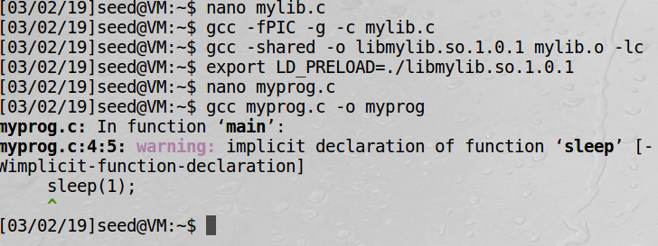


#### Step2

* Make myprog a regular program, and run it as a normal user.

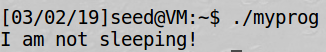

* Make myprog a Set-UID root program, and run it as a normal user.

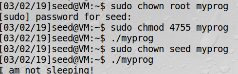

Note : Apabila program di ubah owner ke root, sleep berfungsi, jika diubah owner seed, injeksi sleep berhasil, menandakan env yang berbeda

* Make myprog a Set-UID root program, export the LD_PRELOAD environment variable again in the root account and run it.

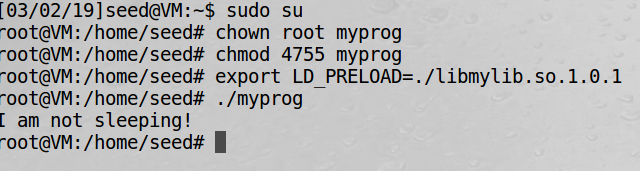


* Make myprog a Set-UID user1 program (i.e., the owner is user1, which is another user account), export the LD_PRELOAD environment variable again in a different user's account (not-root user) and run it.

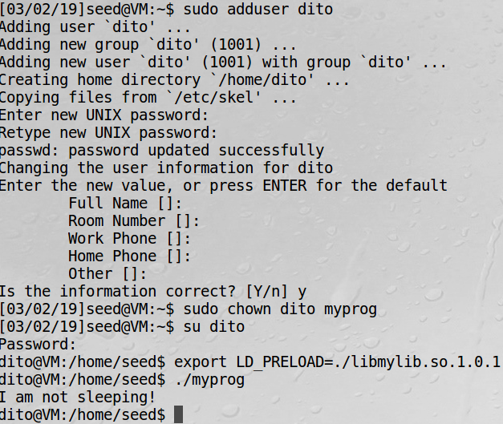

***

### Task 8: Invoking external program using system() versus execve()

Func system() dan execve() dapat digunakan untuk menjalankan program baru. system() cukup berbahaya jika digunakan dalam privilaged program, seperti set-uid program.
kita telah mengetahui bagaimana PATH env mempengaruhi perilaku system(), karena variable mempengaruhi bagaimana shell bekerja. execve() tidak ada masalah, karena tidak memanggil shell, dalam memanggil shell juga punya konsekuensi bahaya lainnya, tapi saat ini tidak ada yg bisa dilakukan dengan env variable, kita lihat skenario dibawah ini

Bob works for an auditing agency, and he needs to investigate a company for a suspected fraud. For the investigation purpose, Bob needs to be able to read all the files in the company’s Unix system; on the other hand, to protect the integrity of the system, Bob should not be able to modify any file. To achieve this goal, Vince, the superuser of the system, wrote a special set-root-uid program (see below), and then gave the executable permission to Bob. This program requires Bob to type a file name at the command line, and then it will run /bin/cat to display the specified file. Since the program is running as a root, it can display any file Bob specifies. However, since the program has no write operations, Vince is very sure that Bob cannot use this special program to modify any file.

```objective-c

#include <string.h>
#include <stdio.h>
#include <stdlib.h>

int main(int argc, char *argv[])
{
    char *v[3];
    char *command;

    if(argc < 2) {
        printf("Please type a file name.\n");
        return 1;
    }

    v[0] = "/bin/cat"; v[1] = argv[1]; v[2] = NULL;

    command = malloc(strlen(v[0]) + strlen(v[1]) + 2);
    sprintf(command, "%s %s", v[0], v[1]);

    // Use only one of the followings.
    system(command);
    // execve(v[0], v, NULL);

    return 0;
}

```
**

#### Step 1

kita compile program diatas, buat owner nya root, kemudian buat set-UID program.
program akan menggunakan system() untuk memanggil perintah.

"If you were Bob, can you compromise the integrity of the system? For example, can you remove a file that is not writable to you?"


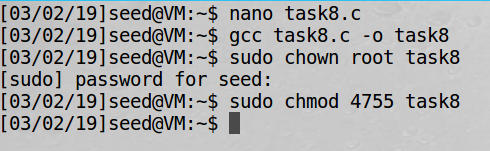

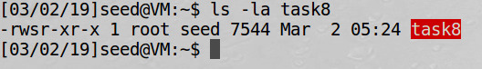

ya, kita bisa remove, mv dan lain lain dengan root privilage jika kita menjalankan program diatas , dengan cara :

    ./task8 "coba;mv coba coba_hacked"

dengan memberikan semicolon pada namafile dan menambah baru command lainnya.

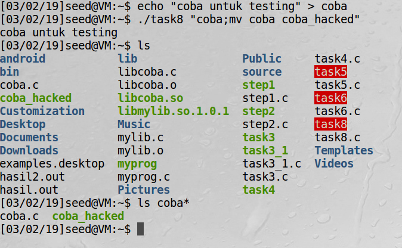


#### Step2

comment out system(command) dan uncomment execve() statement; compile set owner root dan set-uid program

hasil :

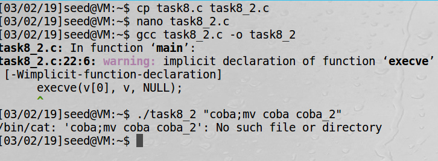

attack tidak bisa kita dilakukan


***

### Task 9: Capability Leaking

```objective-c
#include<stdio.h>
#include<stdlib.h>
#include<fcntl.h>

void main()
{
    int fd;

    // Assume that /etc/zzz is an important system file,
    // and it is owned by root with permission 0644.
    // Before running this program, you should creat
    // the file /etc/zzz first.
    fd = open("/etc/zzz", O_RDWR | O_APPEND);
    if(fd == -1) {
        printf("Cannot open /etc/zzz\n");
        exit(0);
    }

    // Simulate the tasks conducted by the program
    sleep(1);

    // After the task, the root privilege are no longer needed,
    // it's time to relinquish the root privileges permanently.
    setuid(getuid());   // getuid() returns the real uid

    if(fork()) {    // In the parent process
        close(fd);
        exit(0);
    } else {    // in the child process
        // Now, assume that the child process is compromised, malicious attackers
        // have injected the following statements into this process

        write(fd, "Malicious Data\n", 15);
        close(fd);
    }
}
```

compile code diatas dengan root dan jalankan dengan normal user, apakah tulisan malicious data bisa tertulis?

hasil :

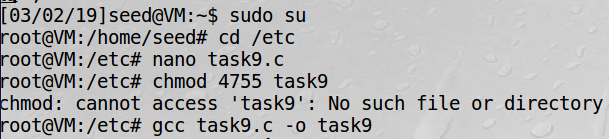
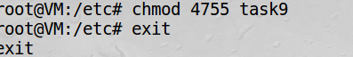

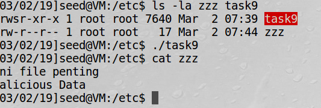

berhail menulis malicious data, yey !


***

### 0x2 Extra

For other seedlab project like binary overflow dll, please visit github.com/dmcr7 hehehe
